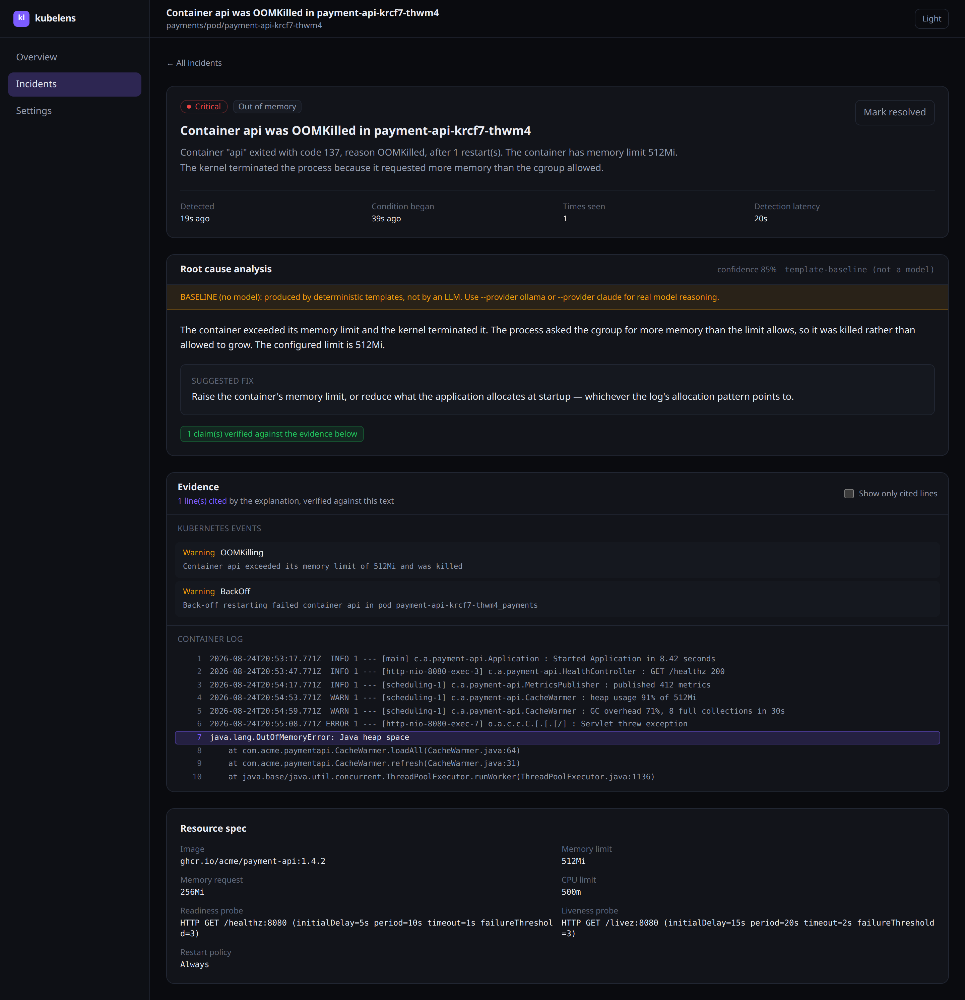
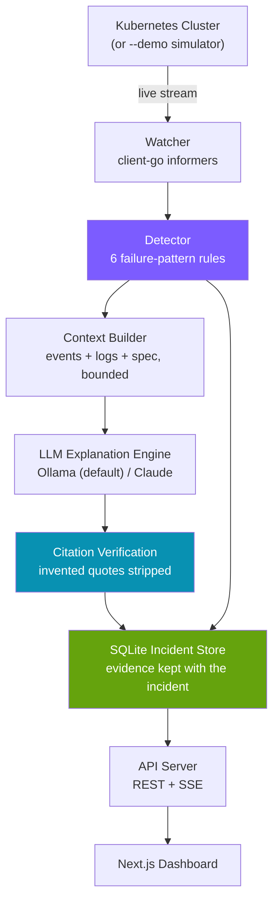

# kubelens

[](https://github.com/mdryaaan/kubelens/actions/workflows/ci.yml)
[](https://pkg.go.dev/github.com/mdryaaan/kubelens)
[](https://go.dev/dl/)
[](https://nextjs.org)
[](LICENSE)

**kubelens watches your cluster, explains what's actually wrong in plain English, and shows you exactly which log lines it based that on — runs with a real cluster or a built-in demo mode, local LLM by default.**

`kubectl describe pod` tells you a container is in `CrashLoopBackOff`. It does not tell you why, and it does not tell you what to do. kubelens watches the cluster with client-go informers, detects six real failure patterns deterministically, gathers the logs and events that explain each one, and turns them into an analysis where **every claim is tied to the line it came from** — verified against the evidence before you ever see it.

```
Detect  →  the rules read container statuses, events, and rollout conditions
Explain →  a model reads the logs, the events, and the spec
Verify  →  every quote is checked against that evidence; invented ones are stripped
Show    →  the claim and the highlighted line sit side by side
```

<br>

<div align="center">
  
  <p><em>The whole product in one screen — the analysis, and the exact log line it rests on.</em></p>
</div>

---

## Features

- **Six real failure patterns** — crash loops, OOM kills, image pull failures, probe failures, unschedulable pods, and stalled rollouts. Each one detected from the actual Kubernetes fields, not from log grepping.
- **Detection never depends on a model.** The rules read `containerStatuses`, `Event` objects, and `Deployment` conditions. Turn the LLM off entirely and kubelens still works.
- **Every claim is cited, and every citation is checked.** A quote that does not literally appear in the evidence is stripped before it reaches the API — and the count of what was dropped is shown, not hidden.
- **Evidence outlives the pod.** Logs and events are stored with the incident, so an explanation written yesterday can still be checked today against a pod that no longer exists.
- **Local by default** — Ollama, no API key, and container logs never leave the machine. Claude is one flag away.
- **A demo mode that is the real pipeline.** `--demo` runs a deterministic simulator through the *same* detector, store, and API as a live cluster. Seeded, so two runs produce the same incidents.
- **A real evaluation** — 30 hand-labelled incidents, per-category precision and recall, a confusion matrix, confidence calibration, and a fabricated-citation count.
- **A dashboard built for 3am** — dark-first, live over SSE, and honest about what it does not know.

---

## Architecture



Two arrows into the store, not one. **An incident is recorded whether or not it is ever explained** — the model sits on a branch of the pipeline, not in the middle of it.

---

## Why this is not "just another LLM wrapper"

Three specific things, each of which you can check in the code:

### 1. The model cannot invent evidence

Every explanation quotes the log lines it relied on. Those quotes are then checked, literally, against the exact evidence the model was shown — [`internal/explanation/citations.go`](internal/explanation/citations.go). A quote that does not appear is removed before it reaches the API, counted, and displayed as *"n fabricated quote(s) dropped before display"* with the offending text struck through.

The comparison is deliberately strict: no case folding, no whitespace normalisation, and quotes under 12 characters are rejected. A check that is lenient about the characters is a check that proves nothing about the content.

This matters because an explanation that quotes a log line reads as authoritative. A fabricated quote does not just fail to help — it manufactures confidence in an analysis that nothing supports.

### 2. Detection is deterministic and testable

The six rules read structured Kubernetes fields, so they are decidable without a model and identical every run. Two examples of the judgement in them:

- **A crash loop only counts while the restart count is still rising.** A pod sits in `CrashLoopBackOff` for a long time after someone fixed the cause, because the backoff timer keeps it there. Firing on the reason alone would page you about a pod that is merely waiting to recover.
- **An OOM kill outranks the crash loop it causes.** An OOM-killed container enters `CrashLoopBackOff` seconds later. Reporting both is technically true and practically useless — the memory limit is the thing to fix.

### 3. There is an evaluation, and it is honest about what it measures

`kubelens eval` scores a provider against 30 hand-labelled incidents. **The ground-truth category is withheld from the prompt** — handing a model the right answer and scoring whether it repeats it would measure copying, not classification.

---

## Evaluation

> **These are baseline numbers from the deterministic template provider. No language model was involved.** They exist as the floor a real model has to beat, and are never presented as model accuracy.

Run it yourself: `make eval`.

| Metric | Value |
|---|---|
| Accuracy | **96.7%** (29/30) |
| Macro F1 | **0.966** |
| Mean confidence when right | 0.50 |
| Mean confidence when wrong | 0.20 |
| Citations verified against the evidence | **100%** (39/39) |
| Fabricated citations | **0** |
| Explained without citing anything | 1 |

### Per category

| Category | Support | Precision | Recall | F1 |
|---|---:|---:|---:|---:|
| `CrashLoopBackOff` | 5 | 0.83 | 1.00 | 0.91 |
| `DeploymentFailure` | 5 | 1.00 | 1.00 | 1.00 |
| `ImagePullBackOff` | 5 | 1.00 | **0.80** | 0.89 |
| `OOMKilled` | 5 | 1.00 | 1.00 | 1.00 |
| `PendingTimeout` | 5 | 1.00 | 1.00 | 1.00 |
| `ProbeFailure` | 5 | 1.00 | 1.00 | 1.00 |

### Where the baseline breaks down

The one miss is `case-014`: a pod whose image reference is `…:0.9.4:latest`, which Kubernetes rejects as `InvalidImageName`. The kubelet's message says *"couldn't parse image reference … invalid reference format"* — it contains no word about pulling, registries, or manifests, so keyword matching lands on the wrong category. **This gap has been left in rather than patched**, because it is exactly the kind of case a language model should get right and a keyword list should not, and it is the sort of thing the harness exists to measure.

### What these numbers do and do not mean

- **They do prove** the pipeline runs end to end, the citation checker works, and every category is exercised by real-looking evidence.
- **They do not prove** anything about a language model, because no model produced them. `0` fabricated citations is not an achievement here either: the baseline lifts its quotes verbatim out of the evidence, so it *cannot* fabricate one. That is a property of the mechanism, stated wherever the number appears.
- **The corpus was written alongside the detector**, which makes it a strong regression suite and a weak generalisation benchmark. Incidents drawn from real public clusters and labelled by someone else would be the honest next step.

To score a real model against the same corpus:

```bash
ollama serve && ollama pull llama3
kubelens eval --provider ollama --model llama3
```

---

## Quick start

**No cluster required.** The demo is the fastest way to see the whole product:

```bash
git clone https://github.com/mdryaaan/kubelens.git
cd kubelens
make demo
```

Then, in a second terminal:

```bash
cd web && npm install && npm run dev
```

| | |
|---|---|
| Dashboard | <http://localhost:3000> |
| API | <http://127.0.0.1:8080/api/health> |
| Live stream | <http://127.0.0.1:8080/api/stream> |

The simulator builds a fake cluster of 19 pods across 4 namespaces and injects a realistic failure every few seconds — a JVM writing a real `OutOfMemoryError` stack trace, a registry returning `manifest unknown`, a scheduler reporting `Insufficient cpu`. It is seeded, so the same run produces the same incidents every time.

### Against a real cluster

```bash
kubelens serve --kubeconfig ~/.kube/config
kubelens serve --kubeconfig ~/.kube/config --namespace payments --namespace auth
kubelens serve --kubeconfig ~/.kube/config --explain --provider ollama --model llama3
```

kubelens needs read access to pods, pod logs, events, and deployments. It never writes to the cluster.

### Install

```bash
go install github.com/mdryaaan/kubelens@latest
```

Go 1.22+. SQLite is pure Go (`modernc.org/sqlite`), so there is no cgo and no build toolchain to install.

---

## Commands

| Command | Purpose |
|---|---|
| `kubelens serve --demo` | Run the whole pipeline against the simulator |
| `kubelens serve --kubeconfig <path>` | Watch a real cluster |
| `kubelens eval --provider ollama` | Score a provider against the labelled corpus |
| `kubelens version` | Version, commit, and build metadata |

Useful flags: `--explain` turns the analysis layer on, `--provider` selects `ollama` / `claude` / `offline`, `--namespace` narrows the watch, `--pending-threshold` tunes how long a pod may stay Pending, `--seed` makes a demo reproducible, and `--addr` moves the API off `127.0.0.1:8080`.

### Make targets

```
make demo         run the product against the simulator
make eval         score the labelled corpus
make test         go test ./... -race with coverage
make build-web    production build of the dashboard
make ci           fmt, lint, test, eval
```

---

## Detection rules

| Rule | What it reads | Severity |
|---|---|---|
| `OOMKilled` | `lastState.terminated.reason == OOMKilled` | Critical |
| `CrashLoopBackOff` | `waiting.reason` plus a **rising** restart count | Critical |
| `ImagePullBackOff` | `waiting.reason` in ImagePullBackOff / ErrImagePull / InvalidImageName | Critical |
| `ProbeFailure` | 3+ `Unhealthy` warnings for one pod inside 5 minutes | Warning |
| `PendingTimeout` | `phase == Pending` past a threshold, plus the `PodScheduled` reason | Warning |
| `DeploymentFailure` | `Progressing` condition gone `False` | Critical |

Rules run most-specific first and the first match wins per resource, so one failing pod produces one incident rather than three.

**Deduplication.** The same condition is one incident with a rising count, not one row per informer update — a crash-looping pod generates updates continuously, and without a cooldown that would be one inference per update.

---

## The CitedLogViewer, and why evidence-linking matters

The incident detail page is built around one component: [`CitedLogViewer`](web/components/ui/CitedLogViewer.tsx). It renders the container log and the Kubernetes events, and highlights the exact lines the analysis cited.

This is the entire point of the product. Consider the difference between:

> The container ran out of memory.

and the same sentence with line 4 of the log highlighted beside it, reading `java.lang.OutOfMemoryError: Java heap space`, above a spec panel showing `memory limit: 512Mi`.

The first is a claim you have to trust. The second is a claim you can **check in about one second**, without leaving the page or opening a terminal. Everything upstream — the bounded context, the schema-constrained response, the citation verification — exists so that this view can be trusted.

The design follows from that goal:

- **Line numbers are assigned once**, in the context builder, and are what citations resolve to. They are printed in the prompt so the model can cite them and so a citation can be checked.
- **The whole log is shown, not only the cited lines.** A highlight is only meaningful against its surroundings; showing only what was cited would hide anything the analysis missed. *(A "show only cited lines" toggle is there for when you already trust it.)*
- **Rejections are visible.** If the model quoted something that was not there, the count and the struck-through text are shown. A tool that silently discards fabrications teaches you to trust it more than you should.
- **Unsupported analysis is labelled.** An explanation that cited nothing gets *"Cited no evidence — treat this as a hypothesis, not a finding"* rather than the same styling as one backed by the log.

---

## Design notes

### Why Ollama by default

Container logs are among the most sensitive text a company has — internal hostnames, customer identifiers, connection strings, and occasionally a credential someone logged by mistake. Shipping them to a third party by default would be the wrong posture for a tool whose entire job is reading them. Local inference means they never leave the machine, needs no account, and costs nothing.

### Why detection and explanation are separate

The detector answers *"is this broken?"* — decidable from structured fields, and it should never be wrong in a way a model could cause. The explainer answers *"why, and what do I do?"* — genuinely open-ended, and where a model earns its cost. Keeping them separate means the failure mode of the model being unavailable is a **degraded** product, not a broken one: incidents are still detected, stored, and streamed, with an "Explain this incident" button waiting.

### Why the demo runs the real pipeline

The simulator implements the same `watcher.Source` interface as the cluster watcher, so demo mode and live mode share the detector, the context builder, the store, and the API. A test asserts that every injected failure is picked up by the real rules — if a rule stops matching, the demo stops showing that incident. A demo running through its own parallel code path proves nothing about the product, and drifts the moment either side changes.

### Detection latency, measured honestly

The overview shows mean time to detect, measured from when the *condition* began — the moment a container was killed, not when its pod was scheduled hours earlier. Conditions that were already true when kubelens started are marked `pre_existing` and **excluded from the average**, because including them would report the age of a problem as the tool's latency.

---

## Project layout

```
internal/
  watcher/      client-go informers → typed events
  detector/     the six rules, dedup, and severity
  context/      bounded evidence: logs + events + the spec fields that explain
  llm/          provider interface, schema, prompts, offline baseline
  explanation/  citation verification — the trust boundary
  store/        SQLite incident history and migrations
  simulator/    the seeded fake cluster behind --demo
  api/          REST handlers, SSE broker
  eval/         harness, scorer, confusion matrix
web/            Next.js 14 dashboard
testdata/eval/  30 labelled incidents and their log excerpts
```

---

## Roadmap

- **StatefulSet, Job, and CronJob rules** — failed jobs and stuck StatefulSet rollouts are the two most-requested gaps.
- **A corpus from real clusters**, labelled by someone who did not write the detector, to replace a regression suite with a real benchmark.
- **A model comparison table** — Ollama, Claude, and the baseline scored side by side on the same corpus.
- **Related-incident grouping** — one bad node produces eight incidents; they should arrive as one.
- **Alert routing** — a webhook per severity, so kubelens can page rather than wait to be looked at.

---

## Contributing

See [CONTRIBUTING.md](CONTRIBUTING.md). In short: a new rule needs a real Kubernetes field to read, table-driven tests including the false positives it must *not* produce, a simulator injector so it shows up in the demo, and cases in the labelled corpus.

## License

MIT © 2026 Md Raiyan. See [LICENSE](LICENSE).
